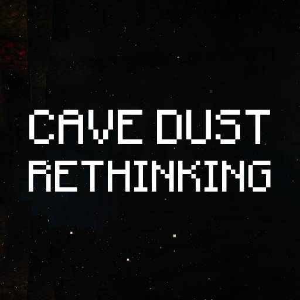

  

<h1 align="center">Cave Dust Rethinking</h1>

  Atmospheric cave dust for Minecraft.

  
  
  

Cave Dust Rethinking adds subtle dust particles to underground spaces. Dust becomes denser with depth, reacts to nearby player movement, and rises around heat sources such as lava, magma blocks, campfires, and torches.

The effect is limited to suitable underground areas and fades in smoothly when entering a cave. Particle amount, spawn radius, height range, and particle type can be configured.

This is an unofficial rework of [Cave Dust by LizIsTired](https://github.com/LizIsTired/cave_dust), maintained for newer Minecraft versions and multiple mod loaders.

## Features

- Depth-based dust density.
- Movement response around the player.
- Upward air movement near heat sources.
- Smooth density changes when entering or leaving caves.
- Configurable amount, radius, height range, and particle type.
- English and Russian translations.
- Client-side only.

## Versions

| Minecraft | Loader |
|---|---|
| 1.20.1 | Forge |
| 1.21.1 | NeoForge |
| 1.21.11 | Fabric |
| 26.1.2 | NeoForge |
| 26.2 | Fabric |
| 26.3 | Fabric, NeoForge |

## Keybinds

- `Numpad +` — toggle cave dust.
- `Numpad Enter` — reload the configuration file.

Keybinds can be changed in Minecraft's Controls menu.
